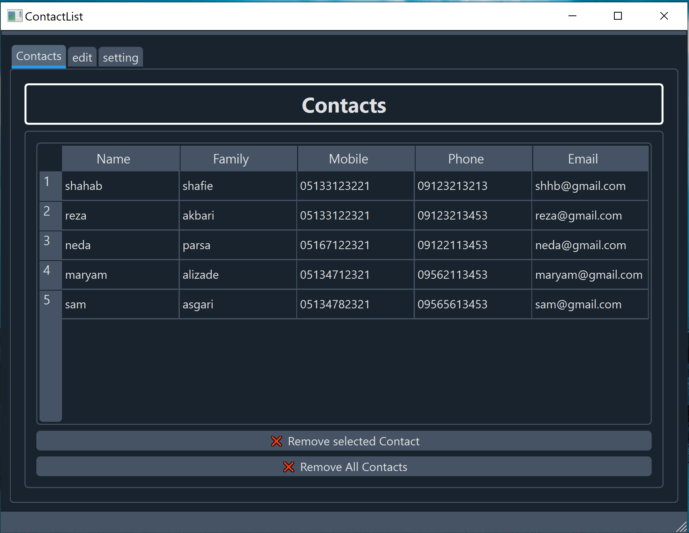
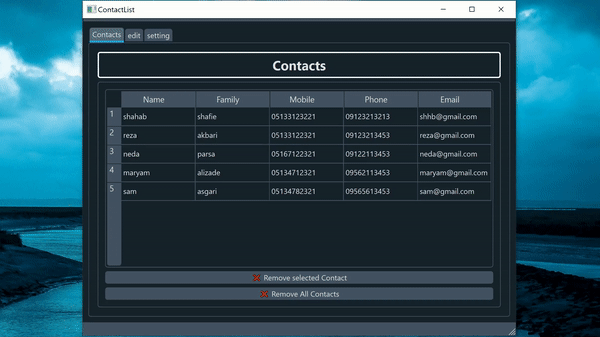
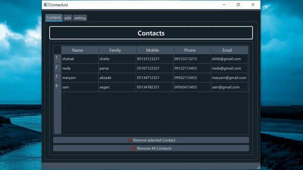

# Contact List with Qt framework
  Download exe link : https://drive.google.com/file/d/1jd6K5HcYMy4JV4Jb2ccEbBKaWL65yL-v/view?usp=sharing
   

  

<h1>add & remove contact</h1>

  
  

<h1>scrollabe & responsive</h1>

  

<h1>Dark & light mode</h1>

  

